# Ringer Application - Database Entity Relationship & Architecture

## 1. Modular Monolith Architecture

The Ringer database implements a **Modular Monolith** pattern inside a single PostgreSQL database:
- **One Database, 9 Schemas**: `identity`, `vendor`, `catalog`, `customer`, `order_management`, `delivery`, `payment`, `notification`, `audit`.
- **Strict Table Ownership**: Each module owns its schema. No other module touches or mutates another module's tables directly.
- **Intra-Module Integrity**: Foreign keys exist **within** a schema (e.g. `order_items` -> `orders`, `product_images` -> `products`, `user_roles` -> `users`).
- **Cross-Module Loose Coupling**: Cross-schema identifiers (e.g. `orders.customer_id`, `orders.vendor_id`, `products.vendor_id`) store `UUID`s without hard DB foreign keys. Integrity is validated in the application/domain layer.

---

## 2. Complete Entity Relationship (ER) Diagram

```mermaid
erDiagram
    %% IDENTITY SCHEMA
    identity_users {
        uuid id PK
        varchar first_name
        varchar last_name
        varchar email UK
        varchar phone UK
        varchar password_hash
        varchar status
        boolean is_verified
        timestamptz created_at
        timestamptz updated_at
        timestamptz deleted_at
    }
    identity_roles {
        uuid id PK
        varchar name
        varchar code UK
        text description
        timestamptz created_at
    }
    identity_user_roles {
        uuid user_id PK,FK
        uuid role_id PK,FK
        timestamptz created_at
    }
    identity_users ||--o{ identity_user_roles : "has"
    identity_roles ||--o{ identity_user_roles : "assigned_to"

    %% VENDOR SCHEMA
    vendor_vendors {
        uuid id PK
        uuid owner_user_id "references identity.users"
        varchar business_name
        varchar business_code UK
        text description
        varchar phone
        varchar email
        varchar status
        timestamptz created_at
        timestamptz updated_at
        timestamptz deleted_at
    }
    vendor_vendor_addresses {
        uuid id PK
        uuid vendor_id FK
        varchar address_line_1
        varchar address_line_2
        varchar city
        varchar state
        varchar country
        varchar postal_code
        numeric latitude
        numeric longitude
        boolean is_primary
        timestamptz created_at
        timestamptz updated_at
    }
    vendor_vendor_users {
        uuid id PK
        uuid vendor_id FK
        uuid user_id "references identity.users"
        varchar designation
        varchar status
        timestamptz created_at
    }
    vendor_vendors ||--o{ vendor_vendor_addresses : "located_at"
    vendor_vendors ||--o{ vendor_vendor_users : "employs"

    %% CATALOG SCHEMA
    catalog_categories {
        uuid id PK
        uuid parent_id FK
        varchar name
        varchar slug UK
        text description
        varchar status
        timestamptz created_at
        timestamptz updated_at
    }
    catalog_categories ||--o{ catalog_categories : "sub_categories"

    catalog_products {
        uuid id PK
        uuid vendor_id "references vendor.vendors"
        uuid category_id FK
        varchar name
        varchar slug
        text description
        varchar sku
        numeric price
        numeric discount_price
        numeric tax_rate
        varchar status
        timestamptz created_at
        timestamptz updated_at
        timestamptz deleted_at
    }
    catalog_categories ||--o{ catalog_products : "categorizes"

    catalog_product_images {
        uuid id PK
        uuid product_id FK
        varchar image_url
        int sort_order
        boolean is_primary
        timestamptz created_at
    }
    catalog_products ||--o{ catalog_product_images : "has_images"

    catalog_product_variants {
        uuid id PK
        uuid product_id FK
        varchar name
        varchar sku
        numeric price
        varchar status
        timestamptz created_at
        timestamptz updated_at
    }
    catalog_products ||--o{ catalog_product_variants : "has_variants"

    %% CUSTOMER SCHEMA
    customer_customer_profiles {
        uuid id PK
        uuid user_id UK "references identity.users"
        date date_of_birth
        varchar gender
        varchar profile_image
        timestamptz created_at
        timestamptz updated_at
    }
    customer_addresses {
        uuid id PK
        uuid user_id "references identity.users"
        varchar address_type
        varchar address_line_1
        varchar address_line_2
        varchar city
        varchar state
        varchar country
        varchar postal_code
        numeric latitude
        numeric longitude
        boolean is_default
        timestamptz created_at
        timestamptz updated_at
        timestamptz deleted_at
    }

    %% ORDER MANAGEMENT SCHEMA
    order_management_orders {
        uuid id PK
        varchar order_number UK
        uuid customer_id "references identity.users"
        uuid vendor_id "references vendor.vendors"
        varchar status
        varchar payment_status
        varchar delivery_status
        numeric subtotal
        numeric discount_amount
        numeric tax_amount
        numeric delivery_fee
        numeric total_amount
        jsonb shipping_address_snapshot
        timestamptz placed_at
        timestamptz confirmed_at
        timestamptz completed_at
        timestamptz cancelled_at
        timestamptz created_at
        timestamptz updated_at
    }
    order_management_order_items {
        uuid id PK
        uuid order_id FK
        uuid product_id "references catalog.products"
        varchar product_name_snapshot
        int quantity
        numeric unit_price
        numeric discount_amount
        numeric tax_amount
        numeric total_amount
        timestamptz created_at
    }
    order_management_orders ||--o{ order_management_order_items : "contains"

    order_management_order_status_history {
        uuid id PK
        uuid order_id FK
        varchar old_status
        varchar new_status
        uuid changed_by "references identity.users"
        text reason
        timestamptz created_at
    }
    order_management_orders ||--o{ order_management_order_status_history : "tracks"

    %% DELIVERY SCHEMA
    delivery_delivery_profiles {
        uuid id PK
        uuid user_id UK "references identity.users"
        varchar vehicle_type
        varchar vehicle_number
        varchar license_number
        varchar status
        timestamptz created_at
        timestamptz updated_at
    }
    delivery_delivery_assignments {
        uuid id PK
        uuid order_id "references order_management.orders"
        uuid delivery_boy_id "references identity.users"
        varchar status
        timestamptz assigned_at
        timestamptz accepted_at
        timestamptz picked_up_at
        timestamptz delivered_at
        timestamptz created_at
        timestamptz updated_at
    }
    delivery_delivery_locations {
        bigserial id PK
        uuid assignment_id FK
        uuid delivery_boy_id "references identity.users"
        numeric latitude
        numeric longitude
        numeric accuracy
        timestamptz recorded_at
    }
    delivery_delivery_assignments ||--o{ delivery_delivery_locations : "logs_gps"

    %% PAYMENT SCHEMA
    payment_payment_transactions {
        uuid id PK
        uuid order_id "references order_management.orders"
        uuid user_id "references identity.users"
        varchar provider
        varchar transaction_reference UK
        numeric amount
        varchar currency
        varchar status
        varchar payment_method
        timestamptz initiated_at
        timestamptz completed_at
        timestamptz failed_at
        timestamptz created_at
        timestamptz updated_at
    }

    %% NOTIFICATION SCHEMA
    notification_notifications {
        uuid id PK
        uuid user_id "references identity.users"
        varchar type
        varchar title
        text message
        varchar reference_type
        uuid reference_id
        boolean is_read
        timestamptz created_at
        timestamptz read_at
    }

    %% AUDIT SCHEMA
    audit_audit_logs {
        bigserial id PK
        uuid user_id "references identity.users"
        varchar action
        varchar module
        varchar entity_type
        uuid entity_id
        jsonb old_values
        jsonb new_values
        varchar ip_address
        text user_agent
        timestamptz created_at
    }
```

---

## 3. Data Dictionary Summary

| Schema | Table | Description | Primary Key | Key Indexes |
| :--- | :--- | :--- | :--- | :--- |
| `identity` | `users` | All platform users (admin, customer, vendor, delivery) | `id` (UUID) | `email` (UK), `phone` (UK), `status` |
| `identity` | `roles` | System roles (`SUPER_ADMIN`, `VENDOR`, etc.) | `id` (UUID) | `code` (UK) |
| `identity` | `user_roles` | Many-to-many user-role assignments | `(user_id, role_id)` | `user_id`, `role_id` |
| `vendor` | `vendors` | Vendor/Restaurant businesses | `id` (UUID) | `business_code` (UK), `owner_user_id`, `status` |
| `vendor` | `vendor_addresses` | Storefront physical locations & coordinates | `id` (UUID) | `vendor_id` |
| `vendor` | `vendor_users` | Staff/Managers associated with a vendor | `id` (UUID) | `(vendor_id, user_id)` (UK) |
| `catalog` | `categories` | Self-referencing category tree (Food -> Pizza) | `id` (UUID) | `slug` (UK), `parent_id` |
| `catalog` | `products` | Items sold by vendors | `id` (UUID) | `(vendor_id, sku)` (UK), `category_id`, `status`, `price` |
| `catalog` | `product_images` | Media assets for catalog items | `id` (UUID) | `(product_id, sort_order)` |
| `catalog` | `product_variants` | Product size/variation options | `id` (UUID) | `(product_id, sku)` (UK) |
| `customer` | `customer_profiles` | End customer demographic info | `id` (UUID) | `user_id` (UK) |
| `customer` | `addresses` | Saved customer delivery addresses | `id` (UUID) | `(user_id, is_default)` |
| `order_management` | `orders` | Master orders with address snapshot | `id` (UUID) | `order_number` (UK), `customer_id`, `vendor_id`, `status`, `placed_at` |
| `order_management` | `order_items` | Order line items with price & name snapshot | `id` (UUID) | `order_id`, `product_id` |
| `order_management` | `order_status_history`| Immutable state machine transition log | `id` (UUID) | `(order_id, created_at)` |
| `delivery` | `delivery_profiles` | Rider vehicle, license, and duty status | `id` (UUID) | `user_id` (UK), `status` |
| `delivery` | `delivery_assignments`| Order-to-rider dispatch records | `id` (UUID) | `order_id`, `(delivery_boy_id, status)` |
| `delivery` | `delivery_locations` | High-frequency GPS ping sequence | `id` (BIGSERIAL) | `(assignment_id, recorded_at)`, `(delivery_boy_id, recorded_at)` |
| `payment` | `payment_transactions`| Gateway transactions & checkout payments | `id` (UUID) | `transaction_reference` (UK), `order_id`, `user_id`, `status` |
| `notification` | `notifications` | In-app user notifications | `id` (UUID) | `(user_id, is_read, created_at)` |
| `audit` | `audit_logs` | High-volume append-only audit trail | `id` (BIGSERIAL) | `(entity_type, entity_id)`, `(user_id, created_at)` |
